# Reliable AI Writing Systems: Detecting & Reducing Hallucinations in Long-Form Generation

**Candidate:** Vitor Barboza  
**Role:** Sr Fullstack Engineer — Learned Hand  
**Date:** February 2026  

---

## Executive Summary

> Long-form AI writing (5–20 pages) suffers from **compounding hallucinations** that single-prompt approaches cannot solve.  
> This proposal presents a **Compound AI System** using an **Iterative Multi-Agent Refinement** loop (Plan → Draft → Critique → Edit) with **Atomic Claim Verification** as the core evaluation metric.

---

## 1. Problem Decomposition

### 1.1 Hallucination Taxonomy

### 1.2 Why Long-Form Multiplies Risk

| Factor | Mechanism | Impact |
|---|---|---|
| **Lost-in-the-Middle** | Transformers lose accuracy on middle tokens (pages 7–14 of 20) | Facts from the "dead zone" are ignored or fabricated |
| **Autoregressive Error Compounding** | Model conditions on its own output — including hallucinations | A lie on page 3 becomes "truth" by page 10 |
| **Cross-Section Coherence Collapse** | Each section generated with different attention patterns | Numbers, names, conclusions drift between sections |

### 1.3 Risk Prioritization

| Priority | Types | Why |
|---|---|---|
| **P0 — Critical** | Extrinsic Fabrication, Citation Hallucination | Destroys credibility instantly; users won't re-check |
| **P1 — High** | Faithfulness Distortion, Intrinsic Contradiction | Caught by careful readers, but damage done if doc is shared |
| **P2 — Medium** | Entity Conflation, Temporal Displacement | Names and dates are scannable — more likely to be caught |
| **P3 — Subtle** | Over-generalization, Compositional Hallucination | Hardest to detect; compositional evades atomic verification |

---

## 2. Evaluation Rubric

> **Core principle:** Success = high rate of verifiable atomic claims, not "the text reads well."

### 2.1 Atomic Claim Verification Pipeline

```mermaid
graph LR
    A["📄 Generated Text<br/>(20 pages)"] --> B["✂️ Claim Extraction<br/><i>Decompose into<br/>atomic statements</i>"]
    B --> C["🔎 Vector DB Lookup<br/><i>Retrieve source chunks<br/>for each claim</i>"]
    C --> D["⚖️ LLM-as-a-Judge<br/><i>Classify each claim</i>"]

    D --> S["✅ Supported"]
    D --> X["❌ Contradicted"]
    D --> U["⚠️ Unverifiable"]

    D -.->|"Sample 1-2%"| HU["👤 Human Audit<br/><i>Calibrate Judge<br/>Pearson correlation</i>"]
    HU -.->|"Feedback loop"| D

    style A fill:#0d6efd,color:#fff
    style D fill:#198754,color:#fff
    style X fill:#dc3545,color:#fff
    style U fill:#ffc107,color:#000
    style HU fill:#6c757d,color:#fff
```

### 2.2 Metric Stack

| Layer | Metric | Cost | Speed | What It Catches |
|---|---|---|---|---|
| **L1 — Heuristic** | **Citation Recall** — Does every claim have a citation? Does the citation ID exist? | 💰 | ⚡ | Citation Hallucination |
| **L2 — Semantic** | **Faithfulness Score** — % of `Supported` atoms / Total atoms | 💰💰💰 | 🐢 | Fabrication, Distortion, Contradiction |
| **L3 — Behavioral** | **Refusal Rate** — System says "insufficient context" instead of guessing | 💰 | ⚡ | Measures system calibration |

### 2.3 Key Trade-offs

| Decision | Choice | Sacrifice | Rationale |
|---|---|---|---|
| **Precision vs. Recall** | Optimize for **high Precision** (low false positives) | Some subtle hallucinations will pass | False alarms erode user trust in the system; missed hallucinations are caught by human review |
| **Cost vs. Depth** | Full ACV on critical sections; **sampled ACV** on body text | Not every sentence is verified | 20-page full ACV costs ~$0.50–1.00/doc in LLM tokens; sampling reduces to ~$0.10 |
| **Latency vs. Accuracy** | **Async verification** — deliver draft, then deliver verified version | User waits for "verified" badge | Streaming UX: show draft immediately, highlight verified sections progressively |

### 2.4 The Ground Truth Problem

- **There is no single "correct" 20-page document** — ground truth is dynamic
- **Solution:** Proxy ground truth via source documents + **human calibration loop**
- **Metric health check:** Measure **Pearson correlation** between LLM-Judge and human annotators on a 50-doc golden set; target **r ≥ 0.85**

---

## 3. Proposed Architecture

> **Approach:** Compound AI System — **Plan → Draft → Critique → Edit** loop  
> **Core insight:** Decompose the 20-page monolith into independent, verifiable sections

### 3.1 Multi-Agent Iterative Refinement

```mermaid
graph TD
    U["👤 User Query<br/>+ Source Documents"] --> P

    subgraph PLAN ["Phase 1: Planning"]
        P["🧠 Planner Agent<br/><i>Generates structured outline (JSON)<br/>+ retrieval queries per section</i>"]
    end

    P --> W

    subgraph DRAFT ["Phase 2: Drafting (per section)"]
        W["✍️ Section Writer Agent<br/><i>Writes ONE section at a time<br/>Context = Outline + Retrieved Chunks<br/>+ Previous Section Summary</i>"]
    end

    W --> CR

    subgraph VERIFY ["Phase 3: Verification"]
        CR["🔍 Critique Agent<br/><i>Extracts atomic claims<br/>Runs ACV against Vector DB<br/>Flags: Supported / Contradicted / Unverifiable</i>"]
    end

    CR -->|"Faithfulness Score < Threshold"| W
    CR -->|"✅ Pass"| E

    subgraph POLISH ["Phase 4: Consolidation"]
        E["📝 Editor Agent<br/><i>Merges sections<br/>Resolves transitions & style<br/>Final consistency check</i>"]
    end

    E --> F["📄 Final Document<br/><i>With inline citations<br/>+ confidence annotations</i>"]

    style U fill:#0d6efd,color:#fff
    style P fill:#6610f2,color:#fff
    style W fill:#fd7e14,color:#fff
    style CR fill:#dc3545,color:#fff
    style E fill:#198754,color:#fff
    style F fill:#0d6efd,color:#fff
```

### 3.2 Why This Architecture

| Design Decision | Rationale |
|---|---|
| **Section-level generation** (not full-doc) | Keeps context window focused → reduces Lost-in-the-Middle |
| **Stateless Writer** (sees Plan + Summary, not raw previous pages) | Prevents autoregressive error compounding |
| **Dedicated Critique Agent** (does not write, only verifies) | Separation of concerns; verification is easier than generation |
| **Critique → Writer feedback loop** | Iterative refinement catches errors before they compound |
| **Citation-based generation** | Forces Writer to emit `[source_id]` tags — ungrounded claims are structurally visible |

### 3.3 Alternatives Considered & Rejected

| Alternative | Why Rejected |
|---|---|
| **Massive Context Window Zero-Shot** (Gemini 1.5 / Claude 3 — all docs in one prompt) | Lost-in-the-Middle still applies; impossible to debug where hallucination started; cost per inference too high for 10k users |
| **Pure Fine-Tuning** | Teaches form/style but does NOT guarantee factuality; cannot generalize to new domains/documents |
| **Simple RAG** (retrieve → generate in one pass) | Standard 512-token chunks cut off reasoning chains; no verification layer; no iterative correction |

### 3.4 Production Realities

| Concern | Mitigation |
|---|---|
| **Latency** (5–10 min for 20 pages with critique loop) | Streaming UX: show Outline instantly (5s), then sections appear as "Drafting → Verifying → Done" |
| **Cost** (Critique doubles token usage) | Use cheaper models (Haiku/Flash) for Draft+Critique; SOTA model (Opus/Sonnet) only for final Edit |
| **Cascading Hallucinations** (Critique Agent itself hallucinates) | Critique does NOT generate text — it only classifies claims as Supported/Contradicted/Unverifiable. Classification is inherently easier than generation |
| **Scalability** (10k concurrent users) | Section Writers are stateless → horizontally scalable; Queue-based architecture with async delivery |

---

## 4. Validation Plan

> **Principle:** Test the hallucination detector first (if it's broken, the architecture is useless)

### 4.1 Two-Week Roadmap

```mermaid
gantt
    title Validation Roadmap
    dateFormat  YYYY-MM-DD
    axisFormat  %b %d

    section Week 1 — Offline
    Build Golden Dataset (50 synthetic docs)           :a1, 2026-02-23, 3d
    Red Teaming — inject 5 poison pills per doc        :a2, after a1, 2d
    Component Eval — Judge Precision & Recall           :a3, after a2, 2d

    section Week 2 — Online
    Shadow Mode — run parallel to existing system       :b1, 2026-03-02, 3d
    Measure real latency & token cost                   :b2, after b1, 2d
    Internal Beta (5% users) — collect feedback         :b3, after b2, 2d
```

### 4.2 What We Test First (and Why)

| Order | Test | Why First |
|---|---|---|
| **1st** | **Critique Agent in isolation** — feed it known (Source, Hallucinated Summary) pairs | If the Judge can't detect planted hallucinations, the entire architecture fails. This is the foundation. |
| **2nd** | **LLM-Judge vs. Human correlation** — run both on the same 50 docs | If correlation < 0.85, we cannot trust automated metrics and need to retune the Judge prompt or model. |
| **3rd** | **End-to-end latency & cost** — Shadow Mode with real docs | Validates whether the multi-agent loop is feasible at production scale. |

### 4.3 Failure Scenarios → Kill Switches

| Scenario | Signal | Action |
|---|---|---|
| Critique Agent has **Recall < 60%** on planted hallucinations | Misses more than 2/5 poison pills | **Abandon** current Judge model; evaluate stronger model or fine-tuned NLI classifier |
| LLM-Judge / Human **correlation < 0.7** | Judge scores diverge from expert annotation | **Pivot** to hybrid approach: automated pre-filter + human-in-the-loop for flagged sections |
| End-to-end latency **> 15 minutes** for 20-page doc | Users drop off before receiving document | **Simplify** architecture: remove Critique loop, fallback to Citation-only verification (L1) |
| Token cost **> $2.00 per document** | Unsustainable at 10k users | **Optimize** by switching Critique to fine-tuned small model (8B) or sampling strategy |

### 4.4 Open Assumptions & Unknowns

- [ ] **Assumption:** Verification is easier than generation → the Judge model is more accurate at classifying errors than the Writer is at committing them. *If false, the architecture collapses.*
- [ ] **Assumption:** Users will tolerate async delivery (minutes, not seconds). *Needs UX testing.*
- [ ] **Unknown:** How does the system handle **synthesis** (novel insights) vs. **summary** (restating facts)? Strict Faithfulness checks may flag valid novel reasoning as hallucination. → Need a **"Novelty Tolerance" parameter** per use case.
- [ ] **Unknown:** How to handle **multi-source conflicts** — when Source A says X and Source B says Y, what does the Critique Agent do? → Need a conflict resolution policy (flag both, prefer recency, prefer authority).
- [ ] **Unknown:** What's the **Compositional Hallucination** recall of our ACV pipeline? Each atom passes, but the combination is false. → May need a dedicated **Relational Verification** module.

---

## 5. Loom Video

**Link:** `[INSERT LOOM LINK]`

### Video Outline (5–8 min)

| Time | Topic | Key Phrase |
|---|---|---|
| 0:00–1:30 | **Key Insight** from Problem Decomposition | *"There are 7 distinct failure modes, not just 'hallucination.' Compositional Hallucination is the blind spot — each atom is true, but the combination is false."* |
| 1:30–3:00 | **Why the Evaluation Rubric is defensible** | *"We don't grade the document holistically — we decompose it into atomic claims and verify each one. The ground truth problem is solved by a human-calibrated LLM-as-a-Judge with r ≥ 0.85."* |
| 3:00–5:00 | **Core trade-off** in Architecture | *"The multi-agent loop doubles cost and adds minutes of latency. But for research reports, a single wrong fact is more expensive than 10 minutes of wait time. We chose accuracy over speed."* |
| 5:00–6:30 | **What I'd test first** | *"The Critique Agent in isolation. If the Judge can't catch planted hallucinations, nothing else matters. That's the load-bearing wall of this architecture."* |
| 6:30–7:30 | **Honest unknowns** | *"My biggest uncertainty is Compositional Hallucination detection and the synthesis vs. summary boundary. These need dedicated research before v2."* |

---

*Built with depth over breadth. Uncertainties are features, not bugs.*
